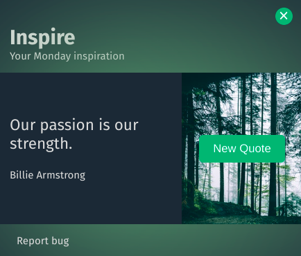

 <!-- markdownlint-disable -->
<h1 align="center">
   
  Inspire
</h1>

  

 
  

A simple browser extension which retrieves one inspiring quote each day for 365 days.The quotes have been hand picked to make your day productive. Enjoy!

<!-- markdownlint-enable -->
<!-- markdownlint-disable headings -->

## Quotes

The quotes used in this browser extesnion are sourced from:

- [Quotable API](https://github.com/lukePeavey/quotable)
- [Type quotes API](https://type.fit/api/quotes)

## Contributing

Be sure to open an issue if you come across a bug or you want to make a feature request.
You will find the code in the [extensios directory](./extensions/).

## License

MIT License

Copyright (c) 2022 Joseph Mawa

Permission is hereby granted, free of charge, to any person obtaining a copy
of this software and associated documentation files (the "Software"), to deal
in the Software without restriction, including without limitation the rights
to use, copy, modify, merge, publish, distribute, sublicense, and/or sell
copies of the Software, and to permit persons to whom the Software is
furnished to do so, subject to the following conditions:

The above copyright notice and this permission notice shall be included in all
copies or substantial portions of the Software.

THE SOFTWARE IS PROVIDED "AS IS", WITHOUT WARRANTY OF ANY KIND, EXPRESS OR
IMPLIED, INCLUDING BUT NOT LIMITED TO THE WARRANTIES OF MERCHANTABILITY,
FITNESS FOR A PARTICULAR PURPOSE AND NONINFRINGEMENT. IN NO EVENT SHALL THE
AUTHORS OR COPYRIGHT HOLDERS BE LIABLE FOR ANY CLAIM, DAMAGES OR OTHER
LIABILITY, WHETHER IN AN ACTION OF CONTRACT, TORT OR OTHERWISE, ARISING FROM,
OUT OF OR IN CONNECTION WITH THE SOFTWARE OR THE USE OR OTHER DEALINGS IN THE
SOFTWARE.
